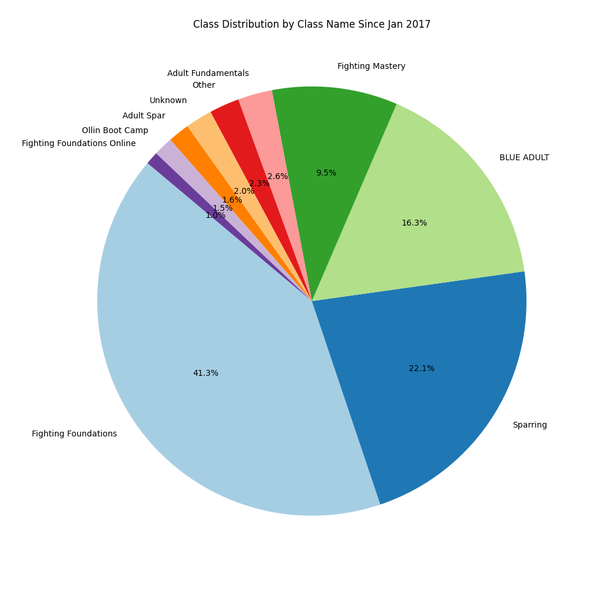

# MindBody Workouts Analysis

This project demonstrates how to extract and analyze workout class activity data from MindBody.com using BeautifulSoup, pandas, and matplotlib for reporting and analysis.

## Overview

The goal of this project is to analyze workout class data from MindBody.com. The analysis includes extracting data from HTML files, cleaning and preprocessing the data, and generating various visualizations to gain insights into the workout schedule.

## Tools and Libraries

- **BeautifulSoup**: For parsing HTML and extracting data.
- **pandas**: For data manipulation and analysis.
- **matplotlib**: For creating visualizations.

## Data Extraction

The data is extracted from HTML files using BeautifulSoup. The relevant information such as day, month, year, category, class name, location, time of day, and duration is extracted and stored in a pandas DataFrame.

## Data Cleaning and Preprocessing

The extracted data is cleaned and preprocessed to ensure it is in a suitable format for analysis. This includes:
- Splitting the `month_year` column into separate `month` and `year` columns.
- Converting the `day` column to numeric.
- Converting the `time_of_day` column to datetime.
- Converting the `duration` column to timedelta.
- Handling missing values in the `class_name` and `time_of_day` columns.

## Visualizations

Several visualizations are created to analyze the workout schedule data:
- **Number of Classes per Month**: A bar chart showing the number of classes each month.
- **Class Distribution by Category**: A pie chart showing the distribution of classes by category.
- **Class Distribution by Time of Day**: A bar chart showing the distribution of classes by time of day.
- **Total Duration of Classes per Month**: A bar chart showing the total duration of classes each month.
- **Class Distribution by Class Name**: A pie chart showing the distribution of classes by class name, with smaller categories aggregated into an "Other" category for clarity.

## How to Run

1. **Clone the repository**:
    ```bash
    git clone https://github.com/yourusername/yourrepository.git
    cd yourrepository/Workouts
    ```

2. **Install the required libraries**:
    ```bash
    pip install pandas matplotlib beautifulsoup4
    ```

3. **Run the Jupyter Notebook**:
    Open `MindBody_Workouts.ipynb` in Jupyter Notebook or JupyterLab and run the cells to see the analysis and visualizations.

## Example Visualizations

### Class Distribution by Class Name


## Conclusion

This project provides a comprehensive analysis of workout class data from MindBody.com. By extracting, cleaning, and visualizing the data, we can gain valuable insights into the workout schedule and class distribution.

Feel free to explore the notebook and modify the analysis as needed. If you have any questions or suggestions, please open an issue or submit a pull request.

## License

This project is licensed under the MIT License - see the LICENSE file for details.